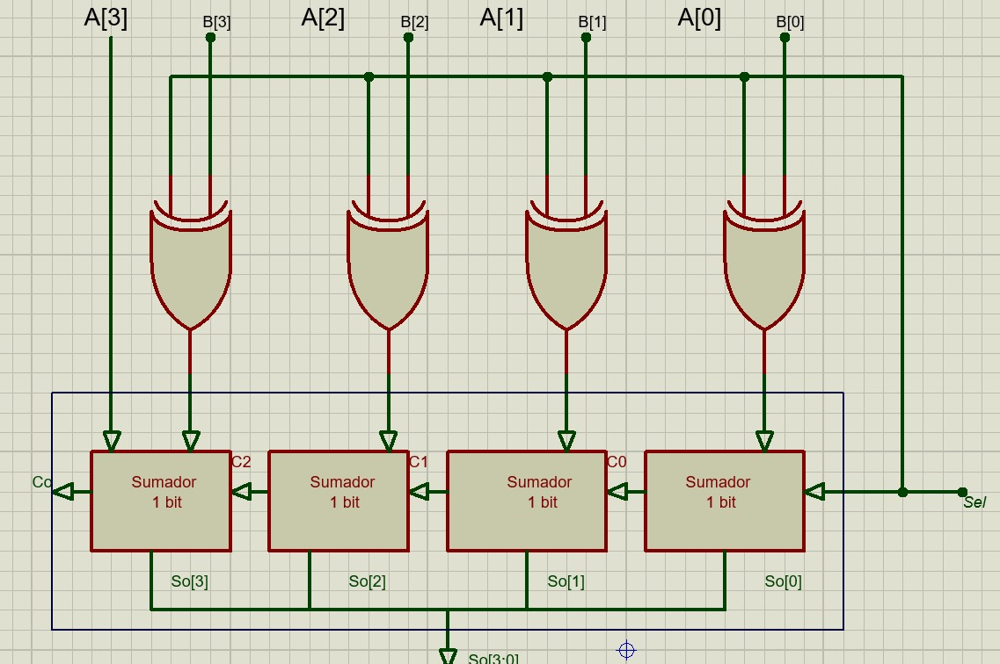
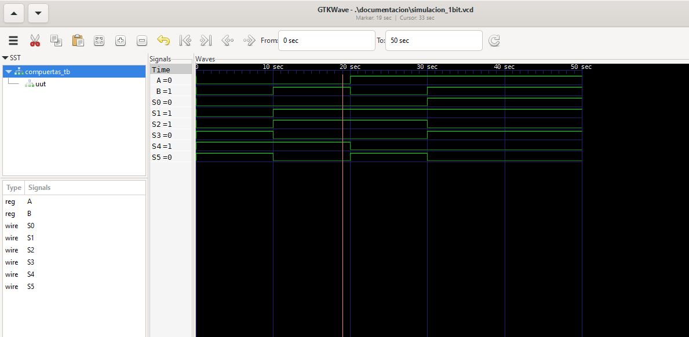
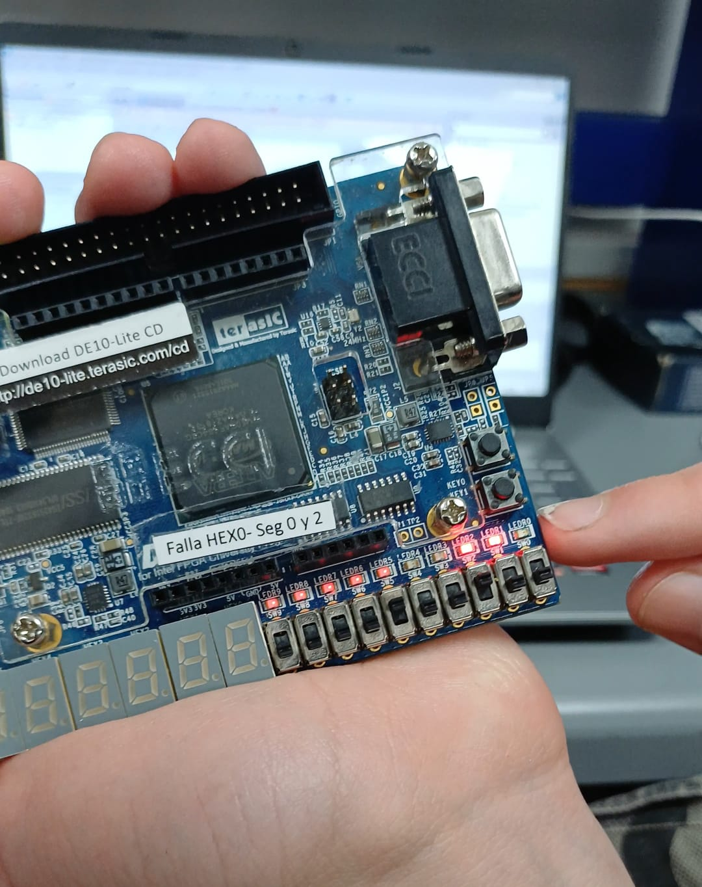

# Lab02 - Sumador/Restador de 4 bits

# Integrantes
* [Diego Alexander Baron Pacheco](https://github.com/DiegoBp777) 
* [Jareth Santiago Escamilla Marquez](https://github.com/jarethescamilla)
* [Fredy Vicente Patiño Garzon](https://github.com/fredyvipatinoga-crypto)

Grupo 2 (de los makias)

# Informe

Indice:

1. [Documentación](#documentación-de-los-circuitos-implementados-implementado)
2. [Simulaciones](#simulaciones)
3. [Evidencias de implementación](#evidencias-de-implementación)
4. [Preguntas](#preguntas)
5. [Conclusiones](#conclusiones)
6. [Referencias](#referencias)

## Documentación del diseño implementado

### 1. Sumador/Restador

#### 1.1 Descripción

En este laboratorio se diseñó e implementó un sumador/restador de 4 bits utilizando lenguaje de descripción de hardware (Verilog) sobre una FPGA.

El sistema permite realizar dos operaciones:

* Suma (M = 0):
Se suman directamente los operandos A y B.

* Resta (M = 1):
Se utiliza el método de complemento a 2, donde:
*  Se invierten los bits de B mediante compuertas XOR.
*  Se suma 1 utilizando el acarreo de entrada.

La operación realizada se define mediante una señal de control Sel.

🔹 Funcionamiento

El circuito está compuesto por:

* 4 sumadores de 1 bit conectados en cascada (ripple carry adder)
* Compuertas XOR para modificar la entrada B
* Una señal de control Sel

El comportamiento es:

Si Sel = 0:
* B pasa sin cambios
* No se suma acarreo inicial
* Resultado: A + B

Si Sel = 1:

* B se invierte (complemento a 1)
* Se suma 1 mediante Cin
* Resultado: A - B

#### 1.2 Diagramas

El diseño utiliza una arquitectura modular basada en sumadores de 1 bit, conectados en cascada para propagar el acarreo. Las compuertas XOR permiten implementar la operación de resta mediante complemento a 2.

## Simulaciones 

### 1. Simulación del sumador/restador

#### 1.1 Descripción

Se realizó la simulación del sistema utilizando un testbench en Verilog, verificando el comportamiento del circuito para diferentes combinaciones de entrada.

Casos evaluados:

* Suma de números binarios
* Resta utilizando complemento a 2
* Casos con acarreo
* Validación de resultados negativos

#### 1.2 Diagrama

En la simulación se observa que el sistema responde correctamente a la señal de control Sel, realizando suma cuando Sel = 0 y resta cuando Sel = 1. Los resultados coinciden con los valores esperados teóricamente.

## Evidencias de implementación

🔹 Video de implementación

🔹 Foto Implementacion

🔹 Descripción Foto 
 (La foto muestra el resultado binario de la suma 4+2)

El sistema fue implementado en la FPGA DE10-Lite utilizando:

* Switches para ingresar los operandos A y B
* Un switch adicional para seleccionar la operación
* Leds para visualizar la salida

El circuito funcionó correctamente tanto para suma como para resta.

## Conclusiones
* Se implementó correctamente un sumador/restador de 4 bits en FPGA.
* Se comprendió el uso del complemento a 2 para realizar restas en hardware.
* Se validó el diseño mediante simulación y pruebas físicas.
* Se reforzaron conceptos de diseño modular y propagación de acarreo.

## Referencias
* Guía del laboratorio – Técnicas Digitales
* Documentación de Intel FPGA
* Material de clase
